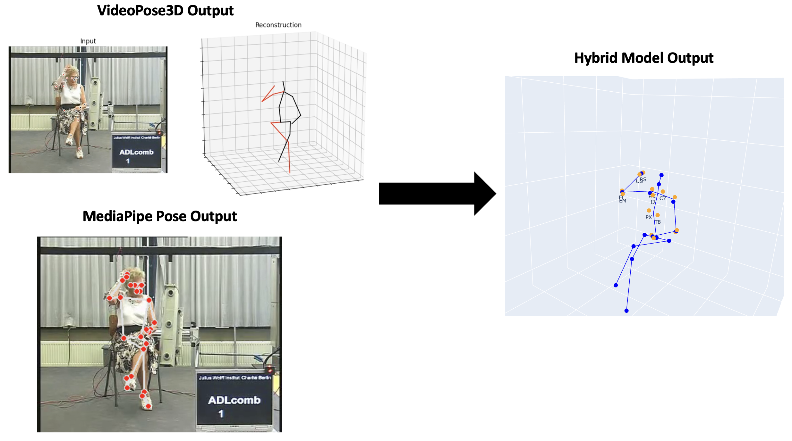

# Human Pose Estimation with Hybrid Model - User Guide
This repository offers a framework (Hybrid Model) for estimating the 3D coordinates of 27 body keypoints from videos featuring a single individual. The estimated keypoints can be utilized in biomechanical models for kinematic and dynamic analysis. The Hybrid Model was developed in the thesis *"Upper Limb Musculoskeletal Dynamics Using a Monocular 3D Human Pose Estimation Markerless System"*, which aimed to evaluate the effectiveness of a monocular 3D HPE Model for perfoming biomechanical analysis of human motion using a musculoskeletal model. 

This framework combines the information from two open-source 3D monocular pre-trained algorithms (**VideoPose3D** and **MediaPipe Pose**), to enhance pose estimation. This README provides step-by-step instructions on how to apply this Hybrid Model in multiple input videos.

## How to Implement the Hybrid Model in Any Video

### Step 1: Upload Necessary Dependencies
- Upload the *'VideoPose3D'* folder (included in this repository) to your Google Drive. This folder is necessary for accessing and running the pre-trained VideoPose3D algorithm.

### Step 2: Upload Your Input Videos
- Upload a folder containing the input videos (`.mp4`) to your Google Drive.
- Ensure each video has a unique and identifying number.
- The videos must feature only a single person.

### Step 3: Open the Colab Notebook
- Open the Hybrid Model directly on Google Colab using this [link](https://colab.research.google.com/drive/1uJyhlSCVim_g5H02v8AjY2lFa_7JBWO_?usp=sharing). The notebook is also available in the repository under the *'Colab_notebook'* folder.
- Ensure that the Runtime Type is set to *'T4 GPU'*.
- In the first cell of the notebook, connect your Google Drive to Google Colab to access the previously uploaded folders.
  
### Step 4 - Generate VideoPose3D Output:
- Run the following cells of the Colab Notebook sequentially to process the videos and generate the 17 keypoint positions estimated by the VideoPose3D algorithm.
- The output will include `.mp4` animations as well as `.npz` and `.txt` files containing the 3D coordinates of each keypoint across all frames. For additional details, see the Colab Notebook comments along the code.

### Step 5 - Generate MediaPipe Pose Output:
- Run the corresponding cells to generate the 33 keypoint positions estimated by the MediaPipe Pose algorithm.
- The output will be `.txt` files with the 3D coordinates of each keypoint for all frames.

### Step 6 - Calculate Additional Body Keypoints:
- Run the cells to compute the additional body keypoints (AC, IJ, PX, EM, EL, RS and US).
-  The first 20 frames of each video are used to create a static trial for calculating IJ and PX.
- Ensure the `.txt` files generated in the previous steps are correctly placed in the *'coordinates_VideoPose3D'* and *'coordinates_MediaPipePose'* folders.
- For detailed information on the calculations, refer to the thesis associated with this project.

### Step 7 - Visualize the Skeleton-based Model:
- Run the provided cell to visualize the skeleton-based model generated by the Hybrid Model for a given frame from a chosen input video.
- Select the directory of the desired `.txt` file (the 27 coordinates estimated by the Hybrid Model are stored in `.txt` files inside the *'coordinates_VideoPose3D'* folder) and the specific frame.
- You can download these `.txt` files and use them as inputs for further biomechanical analysis.

## Repository Contents
- **`Main.ipynb`**: The Colab Notebook for keypoint estimation.
- **`VideoPose3D/`**: Contains necessary files for running the VideoPose3D algorithm (from the original authors' Github repository).
- **`input_video_example/`**: Includes an example input video for testing the Hybrid Model.
- **`Output_VideoPose_example/`**: Contains the .mp4 output animation from VideoPose3D algorithm for the example input video.
- **`Output_MediaPipePose_example/`**: Contains an image output provided by the MediaPipe Pose for example input video.
- **`Output_Hybrid_Model_example/`**: Contains an image output provided by the Hybrid Model for the example input video.

## Bibliography:
- "Upper Limb Musculoskeletal Dynamics Using a Monocular 3D Human Pose Estimation Markerless System". Maria João Candeias Pio, Carlos Quental, Ivo Roupa. Master's Thesis. Instituto Superior Técnico.
- Dario Pavllo. Videopose3d - inference. URL https://github.com/facebookresearch/VideoPose3D/blob/main/INFERENCE.md.
- Google. Mediapipe. URL https://ai.google.dev/edge/mediapipe/solutions/guide.
- Orthoload. Orthoload - loading of orthopaedic implants. URL https://orthoload.com/.

